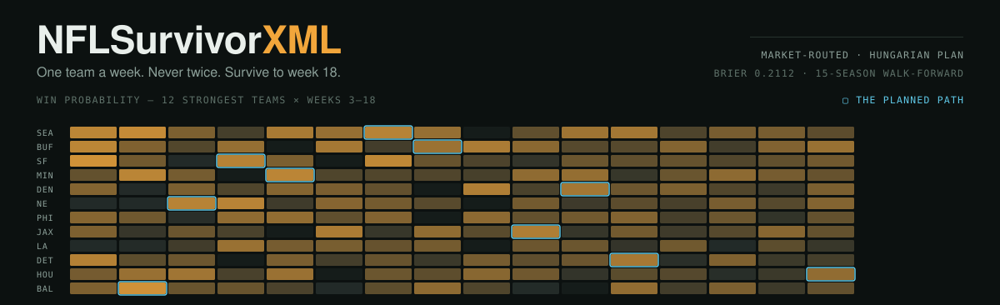
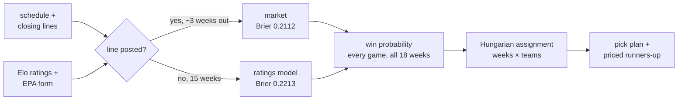

<p>


</p>

Pick one NFL team to win each week. Never reuse a team. Survive to week 18.

This repo predicts every remaining game and then solves which team to spend in
which week — and the headline finding is a negative one, so it leads:

> **Gradient-boosted trees over ~40 features of public NFL data do not beat the
> closing point spread.** They lose on both Brier and log-loss across a
> 15-season walk-forward. The line is an efficient market.
>
> So the machine learning here is not pointed at beating the market. It is
> pointed at the **82% of the schedule the market has not priced yet.**

## Survivor is two problems



**Prediction** the books already solve better than you can — but they only post
lines about three weeks out. **Allocation** is where the game actually is: teams
are a consumable resource, and spending Kansas City on a 78% week-3 game leaves
you nothing for week 14.

## Results

Walk-forward, 2012–2026. Each season predicted by a model that has seen only
strictly earlier seasons. 3,679 games.

| method | log-loss | Brier | accuracy |
|---|---|---|---|
| **market baseline** (closing spread) | **0.6097** | **0.2112** | 66.4% |
| routed model — *what ships* | 0.6097 | 0.2112 | 66.4% |
| boosted trees, all features | 0.6151 | 0.2132 | *66.9%* |
| ratings only (no market) | 0.6324 | 0.2213 | 63.7% |
| raw Elo | 0.6340 | 0.2217 | 64.4% |

The boosted model has the **best accuracy and worse calibration**. That is the
trap: survivor multiplies probabilities across 18 weeks, so being right about
*how sure* you are compounds and being on the right side of 0.5 does not.

Two changes did earn their place — fitting the normal-CDF scale by log-loss
(~11.5) instead of taking the residual SD of margin−spread (13.2), and plain
logistic regression over boosting for the market-free head.

## The optimiser

Maximising survival is `max Π p(team_w, w)` = `max Σ log p(team_w, w)` with each
team used at most once. Logs turn the product into a sum, which makes it exact
linear assignment — Hungarian, milliseconds, no heuristics. On the 2026 schedule:

```
season survival, optimal: 0.0026        THIS WEEK (3)
season survival, greedy : 0.0023        KC at MIA — 84.3%
optimiser edge          : +10.4%        next best SF 77% (−15.2%)
```

`recommend.py` prices every runner-up by forcing that pick and re-solving the
rest of the season, so the cost includes burning that team early — not just this
week's risk. Weeks where that cost is near zero are where your own read should
override the plan.

## Usage

```bash
pip install -r requirements.txt
make data && make features    # nflverse tables → design matrix
make backtest                 # walk-forward vs the closing line
make predict                  # project the season, solve the plan
```

Mid-season, pass the teams you have already spent:

```bash
PYTHONPATH=. python3 -m src.nfl_survivor.predict --used KC,BAL,SF
```

<details>
<summary><b>Known limitations</b> — read before acting on a number</summary>

- **Weeks 4–6 are the least reliable** (Brier 0.2345 against 0.2135 in weeks
  11–14). Early on, Elo is still mostly carrying last season forward and
  over-reacting to two or three games of this one. Those picks deserve the least
  confidence, which is the reverse of what their stated probabilities suggest.
- **No real pick-popularity data.** `pool.py` models the crowd as picking in
  proportion to win probability raised to a power. Real survivor pick
  distributions are published weekly; wiring them in is the highest-value change
  available.
- **The pool simulation is underpowered.** Survival rates of 1–12% leave the
  optimal-vs-greedy gap inside the noise at 3,000 sims. It needs variance
  reduction or an order of magnitude more runs.
- **No injury or starting-QB signal.** The market prices a backup quarterback
  instantly; the ratings head has no idea. This is most of the gap between them.
- **Ties are graded as home losses.** Check your pool's rule — some push.

</details>

<details>
<summary><b>Layout</b></summary>

| file | what it does |
|---|---|
| `ingest.py` | download and load the nflverse tables |
| `ratings.py` | Elo, walked forward one game at a time |
| `features.py` | the game-level design matrix, with the leakage rules |
| `model.py` | market baseline, ratings head, and the routing between them |
| `backtest.py` | walk-forward evaluation, including the models that lost |
| `optimize.py` | Hungarian assignment over the remaining schedule |
| `recommend.py` | runners-up for each week, priced by what switching costs |
| `pool.py` | Monte Carlo against a simulated field |
| `predict.py` | fit, project, and emit the pick plan |

Data sources and the leakage argument: [`docs/DATA.md`](docs/DATA.md).

</details>

---

MIT. Data from [nflverse](https://github.com/nflverse/nflverse-data) under CC-BY-4.0.
